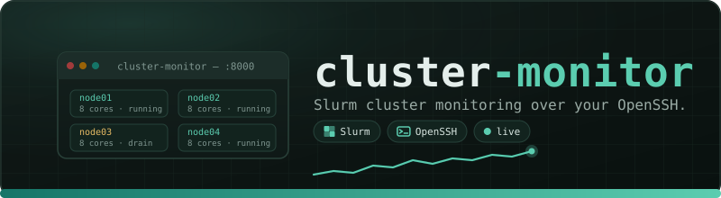

<div align="center">

<!--
  Banner placeholder
  ------------------
  Replace the SVG/PNG link below with the project banner image once artwork is
  ready. Keep the centered layout and surrounding whitespace.
-->


# cluster-monitor

**Local web app for inspecting Slurm clusters and, when explicitly enabled,
submitting and cancelling jobs through your existing OpenSSH client.**

<p>

[](https://www.python.org/)
[](https://fastapi.tiangolo.com/)
[](https://react.dev/)
[](https://www.typescriptlang.org/)
[](https://slurm.schedmd.com/)

</p>

[Getting started](#getting-started) ·
[Features](#features) ·
[Documentation](docs/) ·
[Contributing](#contributing)

</div>

---

`cluster-monitor` is a single-user, loopback-bound web application for
inspecting university and research Slurm clusters that are reachable after
joining a VPN. It works end to end with deterministic mock data, so you can
develop and explore it without a VPN, SSH server, or Slurm installation. Its
real OpenSSH backend has been exercised against Slurm 24.11.1 using `sinfo`,
`squeue`, and `sacct`.

## Features

- **Live cluster overview** — nodes, partitions, and job summaries on one page.
- **Job queue & history** — running, pending, and recently completed jobs.
- **Streaming job logs** — read-only stdout/stderr streams resolved by the
  scheduler, never from browser-provided paths.
- **Topology view** — enriched partition/resource snapshots with optional
  physical Slurm topology.
- **Remote file browser** — explicit per-cluster opt-in for read-only directory
  listing and bounded UTF-8 file preview.
- **Guarded job actions** — submission and cancellation are disabled by default
  and always require an explicit confirmation.

## Getting started

### Prerequisites

- Python 3.12 or newer with [`uv`](https://docs.astral.sh/uv/)
- Node.js 22.22 or newer with npm
- `make` and Bash (Docker, a database, and a local Slurm install are not
  required for mock mode)

### Clone and run

```bash
git clone https://github.com/LucianCrainic/cluster-monitor.git
cd cluster-monitor

make install   # install backend and frontend dependencies
make dev       # start FastAPI and Vite together
```

Open <http://127.0.0.1:5173> — the app boots into mock mode with a local,
deterministic cluster. The backend API is at <http://127.0.0.1:8000>, with
interactive OpenAPI docs at <http://127.0.0.1:8000/docs>.

To connect a real cluster over SSH, see the
[configuration guide](docs/configuration.md) and the
[getting started](docs/getting-started.md) docs.

## Documentation

All sections live in the [`docs/`](docs/) folder:

| Section | Contents |
| --- | --- |
| [Architecture](docs/architecture.md) | Component diagram and repository layout |
| [Getting started](docs/getting-started.md) | Prerequisites, mock-mode quick start, manual setup |
| [Configuration](docs/configuration.md) | YAML clusters, OpenSSH aliases, live-cluster setup |
| [API](docs/api.md) | Endpoint reference |
| [Security](docs/security.md) | Threat model and safety guarantees |
| [Development](docs/development.md) | Commands, known limitations, roadmap |
| [Troubleshooting](docs/troubleshooting.md) | Common issues and fixes |

## Contributing

See the [development guide](docs/development.md) for commands, testing, and
the roadmap. This is a personal learning project; issues and pull requests are
welcome on [GitHub](https://github.com/LucianCrainic/cluster-monitor).

## License

Not yet licensed — see the repository owner before reuse.